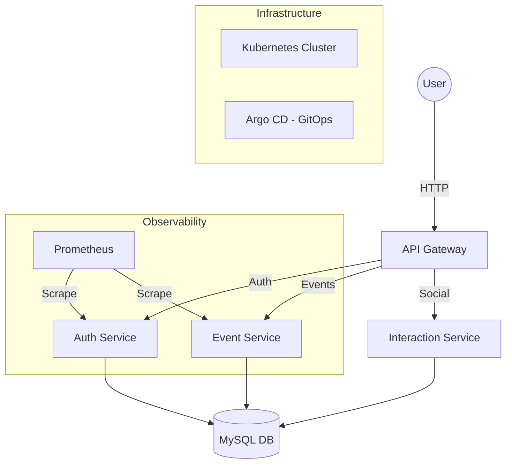

# 🚀 Smart Event Collaboration Platform

[](https://github.com/Mohammed-aymane-saber/Smart-Event-Collaboration-Platform)
[](https://www.docker.com/)
[](https://kubernetes.io/)
[](https://argoproj.github.io/cd/)

A scalable, high-performance microservices-based platform designed for seamless event management and real-time collaboration. This project showcases modern full-stack development combined with advanced DevOps practices.

---

## 🏗️ Architecture Overview

The platform is built using a **Microservices Architecture**, ensuring scalability, fault tolerance, and independent deployment of services.



---

## 🛠️ Tech Stack

### Backend (Microservices)
- **Node.js & Express**: Core logic for each service.
- **MySQL**: Relational database for persistent storage.
- **JWT**: Secure stateless authentication.
- **Prometheus**: Integrated metrics for real-time monitoring.

### Frontend
- **React (Vite)**: Modern, fast, and responsive user interface.
- **Tailwind CSS**: Sleek and professional styling.

### DevOps & Infrastructure
- **Docker & Docker Compose**: Containerization and local orchestration.
- **Kubernetes**: Production-ready orchestration.
- **Argo CD**: Automated GitOps delivery pipeline.
- **PowerShell Scripts**: Automated deployment workflows.

---

## 🚀 Key Features

- **Decoupled Services**: Auth, Events, and Interactions communicate via an API Gateway.
- **GitOps Ready**: Fully integrated with Argo CD for automated deployments directly from GitHub.
- **Monitoring**: Built-in endpoints for Prometheus metrics scraping.
- **Cloud Native**: Designed to be deployed on any Kubernetes cluster.

---

## 🛠️ Getting Started

### Local Development (Docker Compose)

1. Clone the repository:
   ```bash
   git clone https://github.com/Mohammed-aymane-saber/Smart-Event-Collaboration-Platform.git
   cd Smart-Event-Collaboration-Platform
   ```

2. Spin up the infrastructure:
   ```bash
   docker-compose up --build
   ```

3. Access the services:
   - **Frontend**: `http://localhost:5173`
   - **API Gateway**: `http://localhost:3000`
   - **phpMyAdmin**: `http://localhost:8081`

---

## 📈 Monitoring

Each microservice exposes a `/metrics` endpoint for Prometheus. To monitor the health and performance of the system, ensure Prometheus is configured to scrape these targets.

---

## 🤝 Contributing

Contributions are welcome! Feel free to open issues or submit pull requests.

---

**Developed  by [Mohammed Aymane](https://github.com/Mohammed-aymane-saber)**
